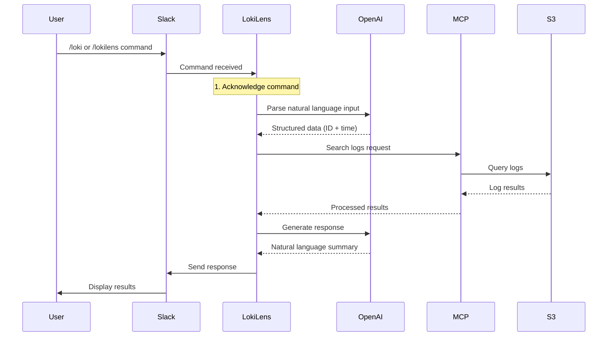
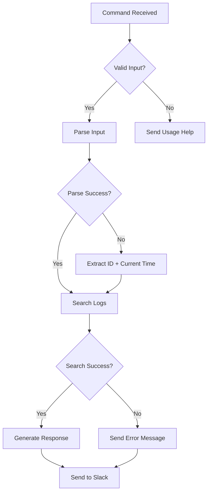

# LokiLens Slack Integration Architecture

## Command Flow



## Components

1. **User Input**
   - Natural language commands in Slack
   - Examples:
     - `/loki 12345 happened yesterday at 3pm`
     - `/lokilens 67890 from last week`

2. **LokiLens Slack App**
   - Handles command routing
   - Manages authentication
   - Coordinates between components

3. **OpenAI Integration**
   - Two main functions:
     1. Natural Language Parsing
        - Converts user input to structured data
        - Extracts search ID and time range
     2. Response Generation
        - Creates human-readable summaries
        - Suggests follow-up actions

4. **MCP (Model Context Protocol)**
   - Handles log search logic
   - Manages time range processing
   - Coordinates with S3

5. **S3 Storage**
   - Stores log files
   - Provides log retrieval
   - Handles file access

## Error Handling



## Data Flow

1. **Input Processing**
   ```
   User Input → OpenAI Parsing → Structured Data
   ```

2. **Log Search**
   ```
   Structured Data → MCP → S3 Query → Log Results
   ```

3. **Response Generation**
   ```
   Log Results → OpenAI Summary → Slack Message
   ```

## Security

- Slack App Token authentication
- AWS S3 credentials
- OpenAI API key
- All sensitive data stored in environment variables 